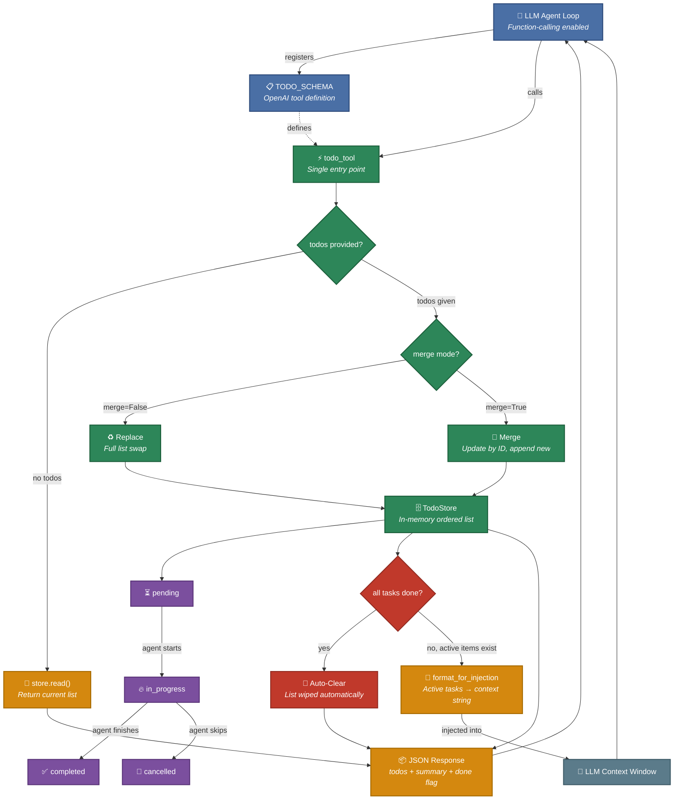

<div align="center">

# hermes-todo

**In-memory task list for AI agents. Zero dependencies.**

[](https://python.org)
[](./LICENSE)
[](./tests)
[](./pyproject.toml)

[Quick Start](#quick-start) · [Usage](#usage) · [API Reference](#api-reference) · [How It Works](#how-it-works)

</div>

---

## Features

| | |
|---|---|
| 🚀 **Zero Dependencies** | Pure Python stdlib — no installs beyond `hermes-todo` itself |
| 🤖 **Agent-Ready** | OpenAI function-calling schema included out of the box |
| 🧭 **Prompt Auto-Launch** | Turn a raw user prompt into a todo list whenever 2+ tasks are detected |
| 🔄 **Smart Merging** | Update individual tasks by ID without losing the rest |
| 🧹 **Auto-Clear** | List wipes itself when everything is done — clean state, always |
| 🖥️ **CLI Rendering** | Built-in terminal-friendly display for Hermes and other agent shells |
| 💉 **Context Injection** | Render active tasks as compact text for LLM context windows |
| ✅ **Validation** | Missing fields get sane defaults — never crashes your agent loop |

---

## Architecture



---

## Quick Start

```bash
pip install hermes-todo
```

```python
from hermes_todo import TodoStore

store = TodoStore()
store.write([
    {"id": "1", "content": "Ship v1", "status": "pending"},
    {"id": "2", "content": "Write docs", "status": "in_progress"},
])

print(store.format_for_injection())
# → [Your active task list was preserved across context compression]
#   - [ ] 1. Ship v1 (pending)
#   - [>] 2. Write docs (in_progress)

print(store.format_for_cli())
# +======================================================================+
# | HERMES TODO                                                          |
# | 2 tasks | active 1 | pending 1 | done 0 | cancelled 0               |
# +----------------------------------------------------------------------+
# | [>] 1. Ship v1                                                       |
# | [ ] 2. Write docs                                                    |
# +======================================================================+
```

---

## Usage

### Standalone Store

```python
from hermes_todo import TodoStore

store = TodoStore()

# Write tasks (replace mode)
store.write([
    {"id": "1", "content": "Implement auth", "status": "in_progress"},
    {"id": "2", "content": "Write tests", "status": "pending"},
])

# Read tasks
items = store.read()

# Merge updates by id
store.write([{"id": "2", "status": "completed"}], merge=True)

# Format for context injection
text = store.format_for_injection()

# Format for a terminal / CLI
cli_text = store.format_for_cli()

# Clear everything
store.clear()
```

### Auto-Launch from a Raw Prompt

```python
from hermes_todo import TodoStore, should_track_prompt

prompt = "Update the README, add integration notes, and run tests"
store = TodoStore()

if should_track_prompt(prompt):
    store.seed_from_prompt(prompt)
    print(store.format_for_cli())
```

### As an Agent Tool (OpenAI Function-Calling)

```python
from hermes_todo import TodoStore, todo_tool, TODO_SCHEMA

store = TodoStore()

# Register the schema with your LLM client
# tools = [TODO_SCHEMA]

# When Hermes passes the raw user prompt, the tool can auto-launch a plan:
result = todo_tool(
    prompt="Update the README, add integration notes, and run tests",
    store=store,
)

# Or the LLM can still manage items explicitly:
result = todo_tool(
    todos=[{"id": "1", "content": "Plan architecture", "status": "pending"}],
    merge=False,
    store=store,
)
# result → JSON string: {"todos": [...], "summary": {...}, "cli": "..."}
```

### Integrating with hermes-agent

```python
import json

from hermes_todo import TodoStore, todo_tool, TODO_SCHEMA, should_track_prompt
from tools.registry import registry

registry.register(
    name="todo",
    toolset="todo",
    schema=TODO_SCHEMA,
    handler=lambda args, **kw: todo_tool(
        todos=args.get("todos"),
        prompt=args.get("prompt"),
        min_tasks=args.get("min_tasks", 2),
        merge=args.get("merge", False),
        store=kw.get("store"),
    ),
    check_fn=lambda: True,
    emoji="📋",
)

# Example pre-tool hook:
# if should_track_prompt(user_prompt):
#     payload = json.loads(todo_tool(prompt=user_prompt, store=store))
#     cli.print(payload["cli"])
```

---

## API Reference

### `TodoStore`

| Method | Description |
|--------|-------------|
| `write(todos, merge=False)` | Write items. `merge=True` updates by ID, `merge=False` replaces all. Returns full list. |
| `read()` | Returns a copy of the current list. |
| `has_items()` | Returns `True` if the list has any items. |
| `seed_from_prompt(prompt, min_tasks=2)` | Build and write a todo list from raw user text when enough tasks are detected. |
| `format_for_cli(width=72)` | Render the full list as a terminal-friendly block. |
| `format_for_injection()` | Renders active items for context injection. Returns `None` if empty. |
| `clear()` | Removes all items. |

### `todo_tool(todos=None, prompt=None, min_tasks=2, merge=False, store=None)`

Single entry point. Reads when no write input is provided, writes explicit todos when `todos` is passed, or auto-launches a list from raw prompt text when `prompt` contains at least `min_tasks` tasks. Returns JSON string with full list, summary counts, a CLI rendering, and a `done` flag when auto-clear empties the list.

### `TODO_SCHEMA`

OpenAI function-calling schema dict. Includes behavioral guidance in the description.

### `VALID_STATUSES`

`{"pending", "in_progress", "completed", "cancelled"}`

---

## How It Works

1. **Agent registers** `TODO_SCHEMA` with its LLM client as an available tool
2. **Hermes or the LLM** can call `todo` with the raw user prompt to auto-launch a list when 2+ tasks are detected
3. **`todo_tool`** routes to prompt auto-launch, explicit write, or read mode
4. **`TodoStore`** validates, merges or replaces, and manages state transitions
5. **Auto-clear** kicks in when all tasks reach a terminal state (`completed`/`cancelled`)
6. **CLI rendering** via `format_for_cli()` gives Hermes a clean terminal view, while `format_for_injection()` keeps the agent context lean

---

## License

MIT — see [LICENSE](./LICENSE) for details.
